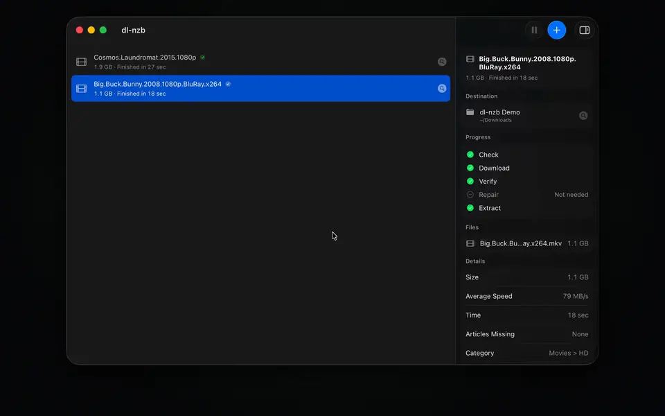
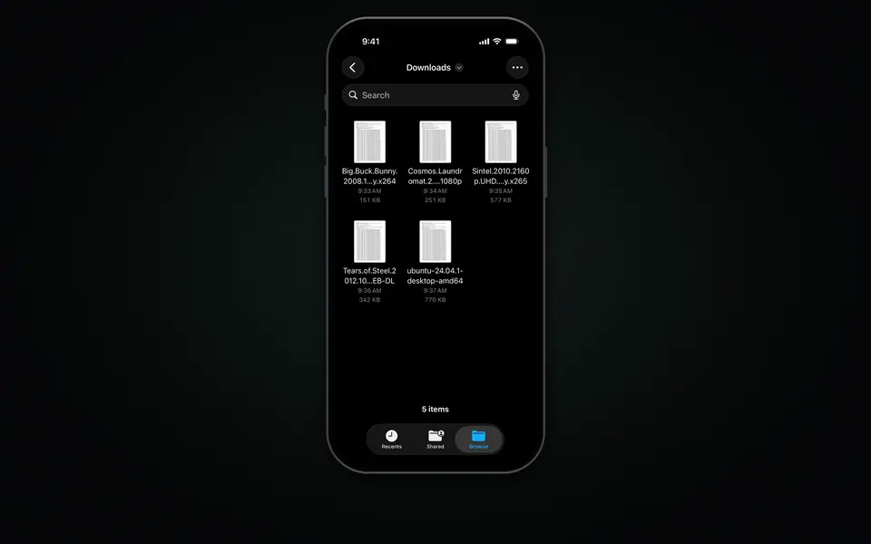

<p align="center"></p>

<h1 align="center">dl-nzb</h1>

<p align="center">Download, repair and extract NZB files quickly: native apps for Mac, iPhone and iPad, and a command line tool, on one Rust core with our own optimized PAR2.</p>

## Quick start

You need a Usenet server account and an NZB file.

<!-- TODO(owner): replace XXXXXXXX in both TestFlight links with the public beta code. -->

| Platform | Get it | Guide |
| --- | --- | --- |
| Mac | [DMG from Releases](https://github.com/zephleggett/dl-nzb/releases/latest) | [Set up a Mac](docs/mac-app.md) |
| iPhone and iPad | [TestFlight](https://testflight.apple.com/join/XXXXXXXX) | [Set up iPhone or iPad](docs/iphone-app.md) |
| Command line | `cargo install` or [release binaries](https://github.com/zephleggett/dl-nzb/releases/latest) | [Command line](#command-line) |

Open the app and add an NZB. It downloads, repairs and extracts; then you're
done.

PAR2 repair uses [par2-rs](https://github.com/zephleggett/par2-rs), a pure-Rust
PAR2 library with SIMD.

## Demos

Simulator demos.

### Mac

<a href="docs/images/mac-demo.mp4"></a>

### iPhone

<a href="docs/images/iphone-demo.mp4"></a>

<a href="https://testflight.apple.com/join/XXXXXXXX"></a>

## Command line

The apps and the command line share nothing. The Mac app can import the
command line's server once, in **Settings > Advanced > Import from dl-nzb CLI…**.

### Install

Download a binary from [Releases](https://github.com/zephleggett/dl-nzb/releases/latest),
or build it with Rust 1.85 or later:

```bash
cargo install --git https://github.com/zephleggett/dl-nzb dl-nzb
```

### Setup

The first run creates a config file; `dl-nzb config` shows where. Add your
Usenet account to it.

Config locations, checked in order:
- Local: `./dl-nzb.toml` (project-local override)
- Linux: `~/.config/dl-nzb/config.toml`
- macOS: `~/Library/Application Support/dl-nzb/config.toml`
- Windows: `%APPDATA%\dl-nzb\config.toml`

Minimal config:
```toml
[usenet]
server = "news.example.com"
port = 563
username = "your-username"
password = "your-password"
ssl = true
connections = 20
```

### Usage

```bash
dl-nzb file.nzb                    # download
dl-nzb -o /path/to/dir file.nzb   # custom output dir
dl-nzb -l file.nzb                # list contents only
dl-nzb -f file.nzb                # download even if the availability check says it can't be repaired
dl-nzb --limit-rate 10M file.nzb  # cap the download speed at 10 MiB/s
dl-nzb --password s3cret file.nzb # extract a password-protected release
dl-nzb test                        # test server connection
dl-nzb config                      # show config location and values
dl-nzb --json file.nzb            # JSON output for scripting
```

### Config reference

```toml
[usenet]
server = "news.example.com"
port = 563                    # 563 for SSL, 119 for plain
username = "user"
password = "pass"
ssl = true
verify_ssl_certs = true
connections = 20              # check your provider's limit
retry_attempts = 2
retry_delay = 500             # milliseconds

[download]
dir = "downloads"
create_subfolders = true      # folder per NZB
# speed_limit = "10M"         # bytes/s cap; K/M/G are 1024-based; absent or 0 = unlimited

[post_processing]
auto_par2_repair = true
auto_extract_rar = true
delete_rar_after_extract = false
delete_par2_after_repair = false
deobfuscate_file_names = true

[tuning]
pipeline_depth = 4            # requests in flight per connection
max_concurrent_connections = 20 # parallel connection creation (raise for faster ramp)
fsync_on_finalize = false     # flush each finished file to disk
```

Keys from older versions that dl-nzb no longer reads (`timeout`,
`force_redownload`, `large_file_threshold`, `[logging]`) are ignored; `-v`
turns on more log output.

Environment variables with the `DL_NZB_` prefix override the config:
```bash
DL_NZB_USENET_SERVER=news.example.com dl-nzb file.nzb
```

### CLI options

```
dl-nzb [OPTIONS] [FILE]...
dl-nzb <COMMAND>

Commands:
  test     Test server connection
  config   Show configuration

Options:
  -o, --output <DIR>    Output directory
  -l, --list            List NZB contents
  -q, --quiet           Errors only (also skips the availability prompt)
  -v, --verbose         Verbose (-vv for debug)
  -f, --force           Download even when the availability check finds too
                        many missing articles for PAR2 to repair
  --limit-rate <RATE>   Cap the download speed: bytes/s, or K, M, G
                        (1024-based, as curl), e.g. 500K, 10M; 0 = unlimited.
                        Overrides `speed_limit` in the config
  --password <PW>       Password for encrypted RAR archives (repeatable)
  --json                JSON output for scripting
  --color <WHEN>        auto (default), always, never
  -V, --version         Show version information
```

Each NZB downloads into its own folder under the output directory. An
interactive run checks article availability first and asks before fetching a
release PAR2 can't repair. `--json` and `-q` runs check only when the NZB has
no PAR2 files, and skip unrepairable releases unless `--force`.

`--limit-rate` (or `speed_limit`) caps the total across all connections, so
the speed shown settles at the limit. Only article bodies are throttled;
logins and health checks never wait on it.

Encrypted RAR archives, hidden file names included, extract with the first
password that works: each `--password` in order, then the NZB's own
(`<meta type="password">`, or `{{password}}` in its file name, as in
`Release{{s3cret}}.nzb`; the folder is named `Release`). If none works, the
download is kept and the run ends with "Archive needs a password"; re-run with
`--password`. Files move into place only once the whole archive is intact, and
`delete_rar_after_extract` deletes only archives that extracted.

Ctrl+C stops the download promptly. Data already received is kept, incomplete
files stay `<name>.partial`, and post-processing is skipped. Press it again to
quit immediately.

The engine is also a library, `dl_nzb::engine`, which the apps use. Build it
without the terminal front end: `cargo build --lib --no-default-features`.

### JSON output

```bash
dl-nzb --json -l file.nzb      # list as JSON
dl-nzb --json file.nzb         # download results as JSON
dl-nzb --json test             # test results as JSON
```

Download results carry `outcome` (`completed`, `completed_with_issues`,
`failed`, `stopped`, `needs_password`, `unrepairable`) and a one-sentence
`message` when it isn't `completed`.

### Requirements

A Usenet provider with NNTP access. Nothing else to install.

## Help

[Mac guide](docs/mac-app.md) · [iPhone guide](docs/iphone-app.md) · [Issues](https://github.com/zephleggett/dl-nzb/issues)

## License

GPL-2.0
